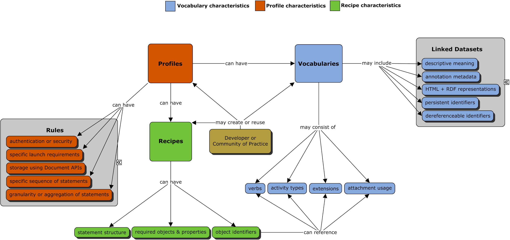

# Relationship Between Vocabularies, Profiles, and Recipes {#relationship-between-vocabularies-profiles-and-recipes}

While this specification directly addresses vocabularies, it is also important to understand the distinct differences and relationships with other terminology often used interchangeably in the xAPI community. This section attempts to provide an opportunity to explain and clarify the specific terminology concepts often used in the xAPI community. Figure 3 (following the terminology descriptions below) further illustrates the characteristics of and relationship between vocabularies, profiles, and recipes.

1.  **Community of Practice (CoP):** A COP is a group of practitioners connected by a common cause, role or purpose, which operates in a common modality. CoPs are focused on implementing xAPI within a specific knowledge domain or use case. CoPs, or independent developers, can create domain-specific vocabularies, profiles, and recipes. These practices usually involve work around defining use cases and curating the various vocabulary terms, synonyms, and other related metadata that might be preferred within a CoP. They canalso reuse existing vocabularies, profiles, and recipes already published by other CoPs or participants of the xAPI community.

2.  **Profile:** A profile is a specific set of rules and documentation for implementing xAPI in a particular context. Profiles generally provide a particular vocabulary of terms, some created specifically for the profile, and some are referenced from other vocabularies. Sometimes a profile might provide multiple vocabularies for different situations, and sometimes someone might curate a vocabulary from multiple sources without creating a profile.

    An example of a project profile is the SCORM profile, which is designed for the traditional self-paced/single learner, online learning use case. An example statement of specifying a profile id in the statement context’s category property is available here: [https://github.com/adlnet/xAPI-SCORM-Profile](https://github.com/adlnet/xAPI-SCORM-Profile/blob/master/xapi-scorm-profile.md#60-mapping-the-scorm-data-model-to-xapi-statements).

    In addition to project profiles (e.g., cmi5, SCORM, IEEE ADB), more granular types of activity profiles can be created to represent specific implementations of learning activities. For example, activity profiles (e.g., assessment or video profiles) can be used as a stand-alone profile or within a broader project profile.

3.  **Vocabulary:** A vocabulary is a list or collection of the terms that are used by a COP for labeling or categorizing information in a particular domain. The use of a vocabulary ensures that everyone is using the same word to mean the same thing. Vocabularies in xAPI mayuse a single list (dataset) or multiple lists (datasets) of specific terms carefully selected for use. Vocabulary datasets should be curated and organized accordingly into groups of Verbs and/or Activity Types. CoPs can publish new vocabulary datasets or reference terms from existing vocabulary sources. Each of the terms in a vocabulary dataset must have or reference a unique IRI. For example, the verb “satisfied” is identified by the IRI, ***```https://w3id.org/xapi/adl/verbs/satisfied```***. Each vocabulary dataset must also have a unique IRI and usually follows an intelligible design pattern consistent with the IRI path of the vocabulary terms it contains (e.g., ***```https://w3id.org/xapi/adl```***). For more details on IRI design guidelines see [Generating and Maintaining IRIs](vocabulary_development_and_publishing/generating_and_maintaining_vocabulary_iris.md)

3.  **Recipe:** Recipes refer to a way of expressing how a common type of learning activity could be syntactically represented in the form of a sample xAPI Statement. A recipe is intended to be reusable by other developers or CoPs. It can specify the statement structure, objects and properties, the required values associated with each object and property, and the object identifiers. Recipes are not required to represented as RDF, but may include human readable examples and descriptions at the IRI location. An example of a Recipe is available here: [http://xapi.trainingevidencesystems.com/recipes/attendance/0_0_1/#simple](http://xapi.trainingevidencesystems.com/recipes/attendance/0_0_1/#simple).

|  |
| --- |
Figure 3\. Relationship between vocabularies, profiles, and recipes.