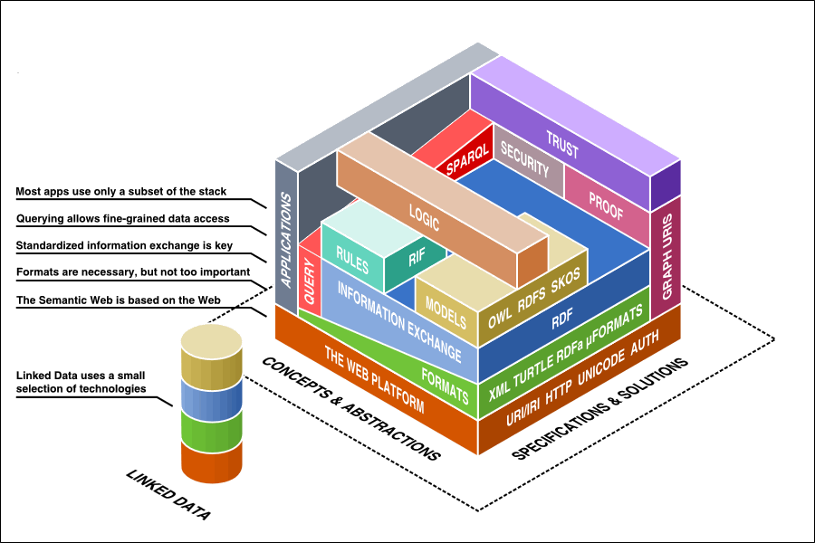

# Semantic Web Technology, Linked Data, and RDF {#semantic-web-technology-linked-data-and-rdf}

The “semantic web” more formally refers to a computer science field that emerged in the early 2000s, and is based on a comprehensive stack of technologies designed and recommended by the W3C. Historically, much of the information on the web has been in the form of HTML content made accessible through hyperlinks. Humans and machines both can process HTML content, but computer applications have difficulty interpreting semantic meaning from it. As a result, semantic web technology was created to solve this problem and serve as a mechanism for expressing and sharing how resources are connected and linked. A resource is commonly understood as anything that can be described and assigned an Internationalized Resource Identifier (IRI). Resources can be divided into two distinct categories (Baskauf, 2014):

1.  **Information Resources**. Anything that can be transmitted electronically (i.e., digital resources). Some examples of this type of resource are html pages, images, graphics, videos, pdf files, etc.
2.  **Non-information Resources** - Things that can’t be transmitted electronically. In addition, they are subdivided into one of the following categories:
    1.  **Physical resource** - a tangible or material thing. Some examples of this type of resource would be a person, place, or any type of physical object or thing (e.g., an animal, a printed book, an office).
    2.  **Abstract resource** - a non-material, non-electronic thing. Some examples of this type would be a concept, a relationship, or a determination.

Linked Data (LD) is a term often used interchangeably with the semantic web. However, semantic web technologies are often inclusive of many more technology components. LD only involves applying a small subset of semantic web technologies that directly address modeling (e.g., RDF Schema [RDFS], OWL, Simple Knowledge Organization System [SKOS]), information exchange (e.g., RDF), data formats (e.g., RDFa, JSON-LD, Turtle), and leveraging the web as a platform (e.g., HTTP, IRIs). In short, LD simply refers to intentionally exposing and sharing resources on the web as RDF data. Figure 1 below provides a visual representation of the larger semantic web stack and illustrates how LD is only a subset of technologies shown here as cylinder-shaped stack.

*Figure 1\. The semantic web technology stack. Artwork by Benjamin Nowack.*

The semantic web technology stack is already being widely adopted across many diverse applications in need of a common data model and framework for publishing, sharing, reusing and aggregating data from different sources. The semantic web and LD naturally fit with and provide a foundation of knowledge representation for xAPI vocabularies. This companion specification for xAPI vocabularies will primarily focus on adopting and implementing LD. Both RDFS and OWL are used to provide a common data modeling approach or schema language for xAPI vocabularies. SKOS is an additional data model that will be leveraged. It provides specific guidelines and options for expressing relationships between vocabulary terms and associating terms with vocabularies. More details on applying SKOS are provided in [Dataset Schema Design](../dataset_schema_design/alignment_with_skos.md) and in the [xAPI Vocabulary Primer](https://). The addition of SPARQL Query Language and Protocol (SPARQL) provides an endpoint and a protocol with a SQL-like capability for openly querying and interacting with any data represented as RDF. In other words, xAPI vocabularies can leverage this entire technology stack to aggregate and describe vocabulary resources (interrelated datasets) using RDF, accessed and dereferenced using HTTP, and queried using SPARQL.More information about SPARQL is provided in [Vocabulary Search and Reuse](../vocabulary_search_and_reuse.md).

. Some examples of SPARQL queries over xAPI vocabularies expressed as LD are also provided in the [xAPI Vocabulary Primer](https://docs.google.com/document/d/1mQDMOussZ7iKkW5jk1sM8KrOOzjsUYVUmSSXyEhk8v8/edit).