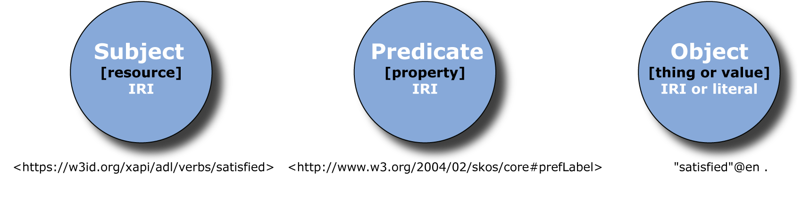

## RDF Data Structure {#rdf-data-structure}

Understanding the core structure of RDF data is fundamental to describing xAPI vocabulary resources. An RDF description of a resource is a basic assertion consisting of three parts. In RDF terminology, this is known as a “triple” (_subject, predicate, object_) statement. Each part of the statement is described as follows:

1.  The **_subject_** represents the resource to be described.
2.  The **_predicate_** represents a property and denotes a trait being asserted about the subject (the predicate expresses a relationship between the subject and the object).
3.  The **_object_** is a literal value or thing corresponding to the predicate (property).

RDF also uses IRIs to name the subject, predicate, and sometimes the object part of the triple. The object can actually be an IRI or a simple literal value. IRIs are a generalization of URIs based on [RFC3986](https://www.ietf.org/rfc/rfc3986.txt), and permit a wider range of international unicode characters. Simple literals have data types that define the range of possible values, such as strings, numbers, and dates. For example, one way to represent the notion "An xAPI verb has the English label ‘satisfied’ in RDF” is as the following triple: a subject denoting the verb (e.g., ***```https://w3id.org/xapi/adl/verbs/satisfied```***), a predicate (property) denoting the prefered label (***```http://www.w3.org/2004/02/skos/core#prefLabel```***), and an object denoting the string value (e.g., “satisfied”@en”). An example RDF triple with an English language label for the ADL verb “satisfied” is further represented in the graphic below.


*Figure 2\. A Simple RDF Triple Example*

IRIs are a key technology to support LD by offering a global identification solution to identify things or concepts in the world. Similarly, the core xAPI specification was intentionally designed to leverage IRIs for identifying Verbs, Activity Types, Attachments, and Extensions. When the core xAPI specification was written, it was envisioned that the IRIs used in xAPI statements could eventually map directly to vocabulary IRIs for more semantic meaning and metadata. Refer to [Vocabulary Development and Publishing](../vocabulary_development_and_publishing/README.md) for an overview of IRIs and best practices for their design and persistence.
